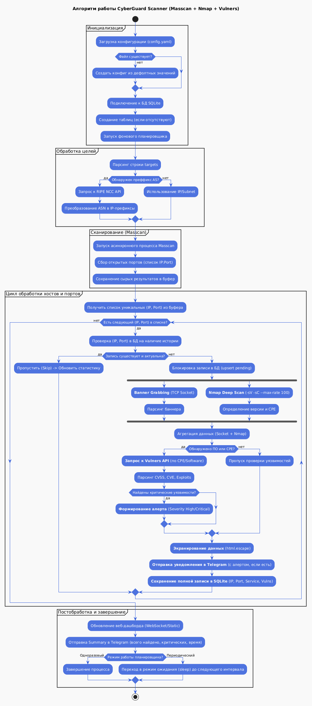

# CyberGuard Scanner

**CyberGuard Scanner** — это комплексное программное решение для автоматизированного мониторинга защищаемого периметра.

Система объединяет возможности сверхбыстрого сканера Masscan, детального анализатора Nmap и интеллектуальной базы уязвимостей Vulners API.

Проект разработан в рамках курса «Алгоритмы и структуры данных» и представляет собой полноценную платформу с веб-интерфейсом, аналитикой и системой оповещений.

## Основные возможности

1. Сканирование и Разведка

- Гибридный подход: Использование Masscan для мгновенного обнаружения портов (до 100 000 пакетов/сек) и Nmap для глубокого анализа версий ПО.
- ASN Resolver: Автоматическое преобразование номеров автономных систем (например, AS42) в актуальные IP-диапазоны через RIPE NCC API.
- Delta-Scanning: Система сравнивает текущие результаты с историей в БД и уведомляет только о новых открытых портах.
2. Анализ уязвимостей (Vulnerability Management)
- Vulners Integration: Использование официального Vulners Python SDK для поиска актуальных CVE по названию и версии сервиса.
- Exploit Finder: Генерация прямых ссылок на готовые эксплойты в базах Exploit-DB и Sploitus для каждой найденной уязвимости.
- Banner Grabbing: Собственный асинхронный модуль для захвата приветственных сообщений (баннеров) сервисов.
3. Управление и Аналитика (Web-Dashboard)
- Интерактивная статистика: Визуализация состояния периметра с помощью Chart.js (распределение сервисов, процент уязвимых узлов).
- Управление через веб: Запуск сканирования, остановка процесса в реальном времени, удаление записей и экспорт отчетов (CSV/JSON).
- Планировщик (Scheduler): Возможность настройки периодического сканирования с интервалом в минутах прямо из интерфейса.

## Технологический стек
- Backend: Python 3.14+ (Asyncio), FastAPI, Uvicorn.
- Database: SQLite (aiosqlite) — асинхронный уровень персистентности.
- Frontend: Jinja2 Templates, Bootstrap 5, Chart.js.
- Библиотеки: httpx (API запросы), pydantic (модели данных), PyYAML (конфигурация), vulners (SDK).
- Системные утилиты: masscan, nmap.

## Быстрый старт

Убедитесь, что в вашей системе (Linux или WSL2) установлены:

```code
sudo apt update && sudo apt install masscan nmap python3-venv -y
```


### Способ 1: Docker
Проект полностью контейнеризирован. Это исключает проблемы с зависимостями.
```code
docker-compose up --build
```


### Способ 2: Локально

1. Установите системные утилиты:
```code
sudo apt update && sudo apt install masscan nmap python3-venv -y
```


2. Подготовьте окружение и установите зависимости:
```code
python3 -m venv venv
source venv/bin/activate
pip install -r requirements.txt
```

3. Запустите приложение (требуются права root для работы Masscan):
```code
sudo PYTHONPATH=. ./venv/bin/python3 app.py
```

## Конфигурация
Все настройки хранятся в config/config.yaml. Если файла нет, он создастся автоматически при первом запуске.

Вы можете редактировать их вручную или через вкладку Настройки в веб-интерфейсе:
- scanner: цели (IP, подсети, ASN), порты, скорость и сетевой интерфейс.
- telegram: токен бота и ID чата для уведомлений.
- vulners: API ключ для поиска CVE.
- scheduling: параметры автоматизации (интервал в минутах).


# Алгоритмическая схема




#### Сверка с ТЗ

1. Обязательные функциональные требования
- Использование Masscan: Ядро системы. Реализован асинхронный запуск и парсинг вывода.
Многопоточность: Masscan работает в raw-режиме с регулируемым max-rate.
Определение портов и сервисов: Реализовано через Banner Grabbing (analyzer.py) и глубокое сканирование Nmap (vulnerability_scanner.py).
Сравнение с предыдущими результатами: Реализовано через SQLite. Система уведомляет только о новых (Delta) находках.
Уведомление владельца: Интегрирован Telegram Bot API с поддержкой HTML-разметки.

2. Соответствие усложнениям
- Асинхронное программирование: Весь проект написан на asyncio (FastAPI, aiosqlite, httpx).
- Модели данных: Использован Pydantic для типизации результатов сканирования.
- ASN (Автономные системы): Реализован резолвинг ASN в IP-префиксы через RIPE NCC API.
- Валидация эксплойтов (exploit-db.com): Добавлена генерация прямых ссылок на Exploit-DB и Sploitus для каждой найденной CVE.

3. Дополнительные возможности
- Веб-дашборд: Реализован на FastAPI + Bootstrap 5. Есть мониторинг, удаление данных и управление сканами.
- Проверка на CVE (Vulners API): Интегрирован официальный Vulners SDK с выводом CVSS-баллов.
- Периодическое сканирование: Встроен планировщик с настройкой интервала прямо из веб-интерфейса.
- Аналитика: Добавлена страница со статистикой и интерактивными графиками (Chart.js).


